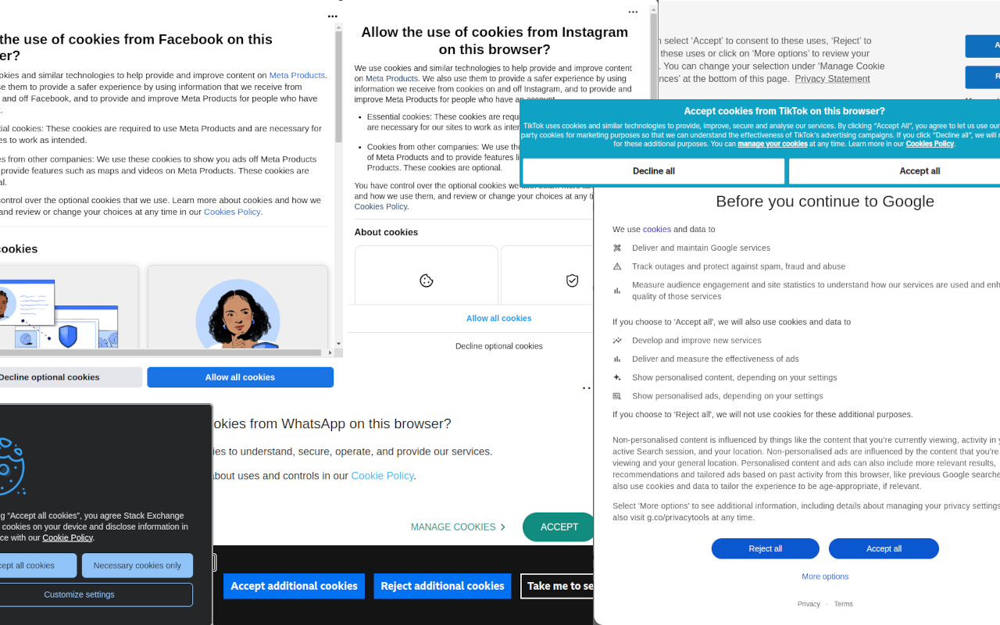

Accept Cookies
==============

A Chrome extension to automatically accept cookie policies so you can get back to browsing.Collects zero data.

What's a cookie policy?
-----------------------
These annoying popups:

How it works
-----------
Rather than hardcoding rules for every website, Accept Cookies uses an algorithm:

1. Searches the DOM and shadow DOMs for elements mentioning cookies.
2. Searches for accept buttons with a common ancestor to the cookie elements.
3. Calculates the distance between every accept button and cookie element pair.
4. Clicks the accept button closest to a cookie element.

Technical Details
-----------------
- Uses mutation observers to efficiently react to DOM changes.
- Overrides `Element.attachShadow` to search shadow DOMs.
- Uses a service worker with `chrome.webNavigation.onCommitted.addListener` to override `.attachShadow` before inline code runs.
- Runs in all frames so cookie policies loaded in iFrames are detected.

Installation
------------
1. Clone/download this repo.
2. Go to the Chrome Extensions page by entering chrome://extensions in a new tab.
3. Enable Developer Mode by clicking the toggle switch next to it.
4. Click the Load unpacked button.
5. Select the downloaded repo directory.

